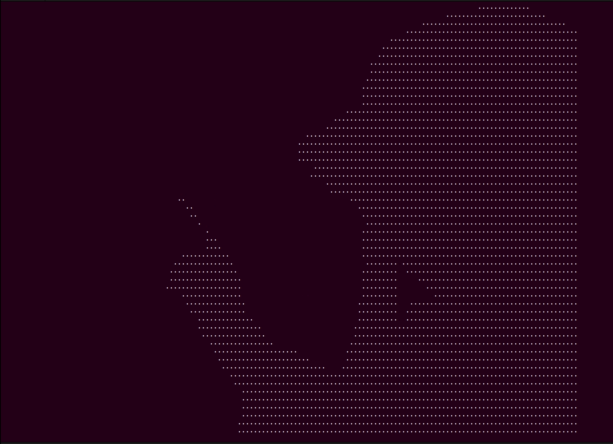

# bad-apple

## 目的
用命令行实现bad apple视频的播放，也可实现各种二值视频的播放。

## 思路
生成相应的txt文件，首先下载一个合适的bad apple的视频流，通过baRead.py输出二值图像的txt文件（在命令行里能够显示的两种字符）。之后调整好命令行的高度和长度，执行run即可。

## shell脚本
脚本里的参数需要根据实际视频流的参数进行调整，需要调整的参数有一页显示的行数、txt文件的总行数以及下采样倍数。脚本文件内容比较简单，可根据具体进行修改。

## 测试
在Ubuntu16.04的命令行里进行测试，能够流畅的播出。通过ssh远程连接服务器后显示会有闪屏，效果不佳，主要原因是ssh后会有网速延迟。

## Demo
{:height="50%" width="50%"}
